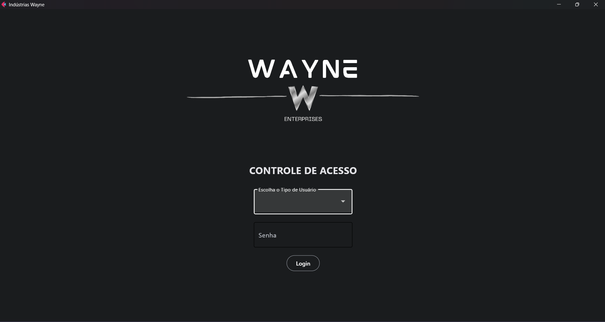
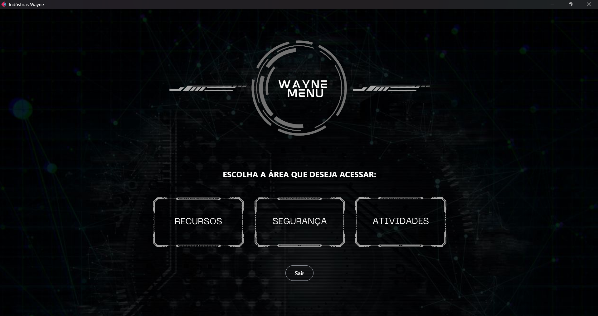

# 🦇 App Wayne

## 📌 Descrição

O App Wayne é uma aplicação full stack desenvolvida como projeto acadêmico, inspirada nas Indústrias Wayne.
O sistema simula uma plataforma corporativa com foco em:

- Controle de acesso e segurança interna
- Gestão de recursos e inventário
- Dashboard de monitoramento de dados operacionais

O objetivo é aplicar conceitos de autenticação, autorização, CRUD e integração frontend + backend em um cenário realista.

## 🚀 Tecnologias

- Python
- Backend: FastAPI
- Frontend: Flet
- SQLite

## 🔐 Funcionalidades

👤 Sistema de Usuários
- Login e autenticação
- Controle de acesso por tipo de usuário (funcionário, gerente, admin)
- Autorização para áreas restritas

📦 Gestão de Recursos
- Cadastro de equipamentos, veículos e dispositivos
- Edição e exclusão de itens
- Organização de inventário interno

📊 Dashboard
- Visualização de dados de segurança
- Indicadores de recursos
- Painel administrativo

## ▶️ Como rodar o projeto
- Pré-requisitos:
    - Python instalado
    - Flet instalado
    - SQLite instalado

- Passo a passo:
    - Clonar o repositório: git clone https://github.com/Raissa-Dev/App-Wayne.git
    - Entrar na pasta: cd App-Wayne
    - Instalar dependências: pip install fastapi uvicorn sqlalchemy aiosqlite
    - Rodar o projeto: python main.py

## 📷 Prints do sistema

### 📌 Tela de Login

### 📌 Menu Principal

